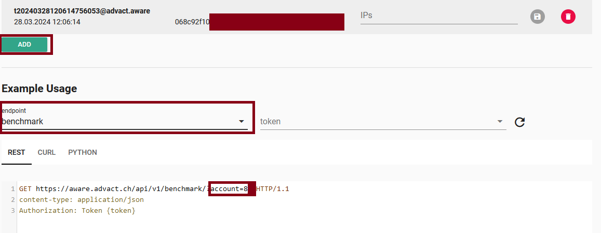

# Get-to-low-level

This script is used to output all recipients whose level score is below a specified minimum threshold. It retrieves recipient data from the API, filters the results based on the provided minimum level score, and displays the relevant recipients along with their scores. 

## Requirements

1. An API token from aware.advact.ch and your account number.
2. Ensure access to a server with PowerShell capabilities.

## Installation

### aware API Token and Acccount Number
To create a new API Token in our application navigate to [aware.advact.ch](https://aware.advact.ch/) and log in. Next, navigate to 'API Settings' and create a new token. To retrieve your account number, select an endpoint; you will then see your account number displayed in the example request.:

Be sure to just copy the number for the Variables used in the script. If environment variables are used in one of the script they will always be called with the prefix:
```
$env:AWARE_TOKEN
$env:ACCOUNT_NUMBER
```

## Usage

### Setup Environment variables:
```
# Set as variables
$AWARE_TOKEN "your_aware_api_token"
$ACCOUNT_NUMBER = "your_aware_account_number"

# Load the variables into enviorement
$env:AWARE_TOKEN = $AWARE_TOKEN
$env:ACCOUNT_NUMBER = $ACCOUNT_NUMBER
```
After setting up the environment variables, you can start the script in powershell as follows:
```
.\get-to-low-level.ps1
```
