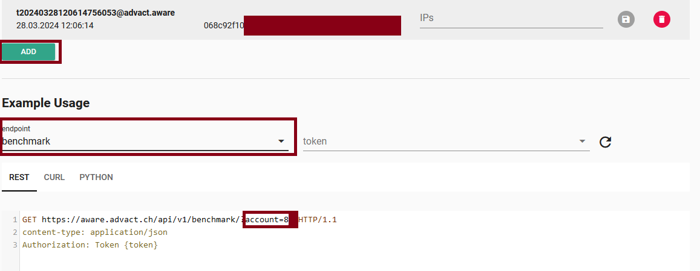
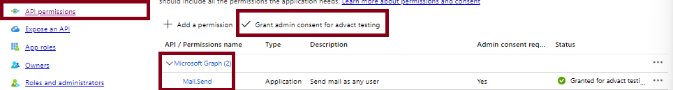
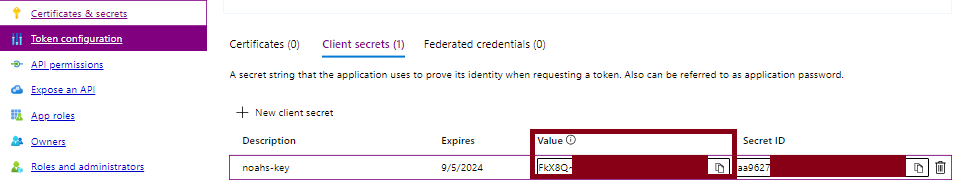

# phishing-service-api-scripts

# What is in this Repository?
This repository is specifically tailored for our customers and is structured to enhance your experience with our phishing services. It contains a carefully curated collection of scripts that you can utilize independently.

The repository is organized into several subdirectories, each dedicated to different aspects. These subdirectories include scripts for automating routine tasks, retrieving data and more, making it easier to find the tools you need.

# Script Descriptions

##  [Get-bad-behaviour](Get-bad-behaviour/README.md)
This script is used to notify supervisors when their subordinate triggered bad behaviour in our Phishing-Simulation Service. It scans for bad behaviour of the last day, and sends an e-mail to each supervisor with the report.

# Requiremens
Those are requirements that you will find over most of those scripts.

## aware API Token and Acccount Number
To create a new API Token in our application navigate to [aware.advact.ch](https://aware.advact.ch/) and log in. Next, navigate to 'API Settings' and create a new token. To retrieve your account number, select an endpoint; you will then see your account number displayed in the example request.:

Be sure to just copy the number for the Variables used in the script.

## Azure Application to send E-Mails via graph API
Navigate to your Azure Portal and create a new App registration and add the necessary API Permissions:

Remember to **grant admin consent**.

This documentation may be helpful:  
https://woshub.com/send-email-microsoft-graph-api-powershell/

### Client Secret in Azure
Navigate to Certificates & Secrets and create a new client secret. Be sure to save the **value** of the newly created secret.

## Using the Scripts

- **Download and Customize**: Customers are allowed to download the scripts and customize them for their own use. We encourage you to explore the scripts and modify them to suit your needs.

## Contributing to the Scripts

- **Suggesting Improvements**: If you have a great idea or improvement for any scripts, you are welcome to submit a request via a "Pull Request". Please follow these steps:
1. Fork the repository.
2. Create your feature branch: `git checkout -b my-new-feature`
3. Commit your changes: `git commit -am 'Add some feature'`
4. Push to your branch: `git push origin my-new-feature`
5. Open a Pull Request.

## Support

- **Support Requests**: All support for this project is offered through GitHub. If you need help or have any support-related questions, please open an "Issue" in this repository.

## Feedback

- **Questions and Discussions**: If you have questions or wish to start a discussion about the scripts, we encourage you to open an "Issue". This helps us stay organized and ensures that we handle all inquiries efficiently.

We look forward to seeing your creative ideas and suggestions, and thank you for your interest and cooperation with us!