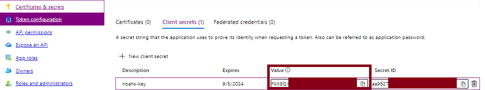

### Azure Application to send E-Mails via graph API
Navigate to your Azure Portal and create a new App registration and add the necessary API Permissions:

Remember to **grant admin consent**.

This documentation may be helpful: <br>
https://woshub.com/send-email-microsoft-graph-api-powershell/


### Client Secret in Azure
Navigate to Certificates & Secrets and create a new client secret. Be sure to save the **value** of the newly created secret.


If environment variables are used in one of the scripts they will always be called with the prefix:
```
$env:ACCESS_SECRET
$env:AZURE_APP_ID
$env:TENANT_ID
$env:MAIL_FROM
```