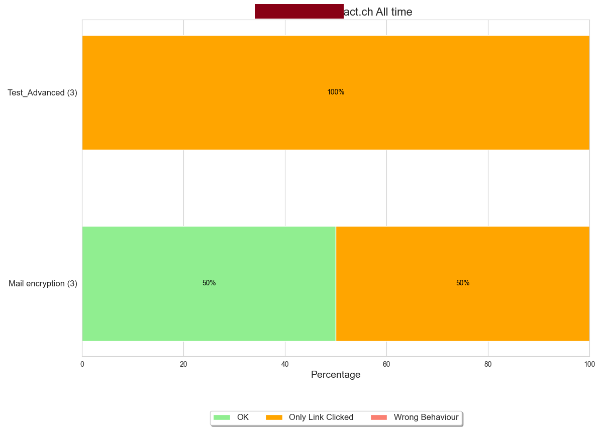

# service-statistic-visualized
This script retrieves all statistics data from each custom field for a selected service and visualizes them in bar chars. This allows you to determine which custom field performs the best, among other insights. The images are saved in the same directory as the script. Users can store a configuration file. The images are saved according to the corresponding custom field names. The bar chars could look like that:


## Requirements

1. An API token from aware.advact.ch and your account number.
2. Ability to execute Python3.

## Installation

### aware API Token and Acccount Number
To create a new API Token in our application navigate to [aware.advact.ch](https://aware.advact.ch/) and log in. Next, navigate to 'API Settings' and create a new token. To retrieve your account number, select an endpoint; you will then see your account number displayed in the example request.:

Be sure to just copy the number for the Variables used in the script. If environment variables are used in one of the script they will always be called with the prefix:
```
$env:AWARE_TOKEN
$env:ACCOUNT_NUMBER
```


## Usage

```
pip install requests pandas matplotlib seaborn
```

Or you can use:

```
pip install -r requirements.txt
```
After that you will be able to launch the script
```
python3 main.py
```